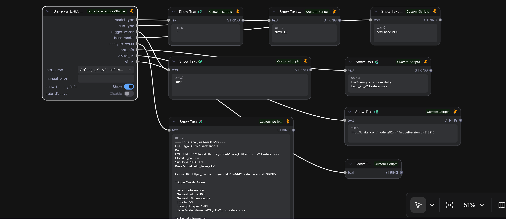
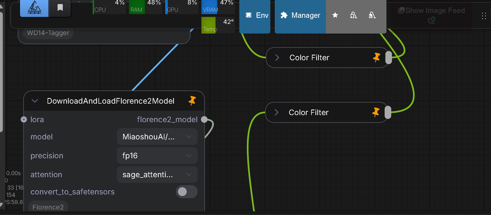
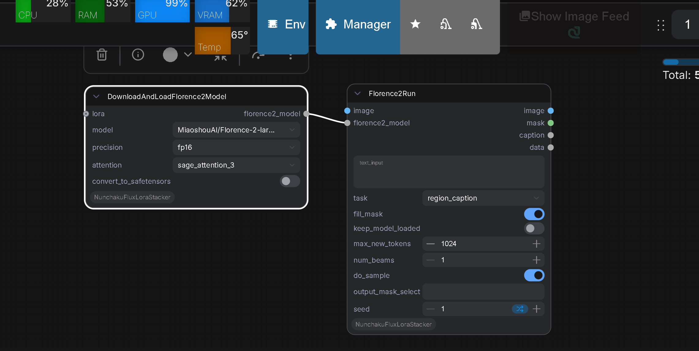

# ComfyUI-NunchakuFluxLoraStack-and-VariousTools

This repository provides **eleven custom nodes** for ComfyUI:

1. **FLUX LoRA Loader V2** (`FluxLoraMultiLoader_10`) - Dynamic multi-LoRA loading with combo box UI for Nunchaku FLUX models
    
    

2. **LoRA Stacker V2** (`LoraStackerV2_10`) - Universal LoRA loader for standard SD models (SDXL, Flux, WAN2.2, etc.) with dynamic 10-slot UI
    
    

3. **SDNQ LoRA Stacker V2** (`SDNQLoraStackerV2_10`) - Dedicated LoRA loader for SDNQ quantized models with dynamic 10-slot UI (designed for use with [comfyui-sdnq-splited](https://github.com/ussoewwin/comfyui-sdnq-splited))
    
    

4. **Model Patch Loader** (`ModelPatchLoaderCustom`) - Load model patches (ControlNet, feature projectors, etc.) with CPU offload support
    
    

5. **Fast Groups Bypasser V2** (`FastGroupsBypasserV2`) - Group-based node control utility (ported from [rgthree-comfy](https://github.com/rgthree/rgthree-comfy))
    
    

6. **Universal LoRA Analyzer** (`UniversalLoRAAnalyzer`) - Analyze LoRA files (model type, trigger words, base model, Civitai/HuggingFace URLs) without loading into the graph
    
    

7. **Color Filter** (`ColorFilter`) - Strip monochrome / black-and-white wording from caption text produced by vision-language tagging (e.g. Florence-2, WD14 Tagger) before feeding prompts to downstream nodes
    
    

8. **Florence-2** (four nodes: `DownloadAndLoadFlorence2Model`, `DownloadAndLoadFlorence2Lora`, `Florence2ModelLoader`, `Florence2Run`) — Load Florence-2–family vision-language checkpoints (Hugging Face download or local `models/LLM`), optional PEFT LoRA, then run captioning, OCR, DocVQA, grounding, segmentation, and prompt-generation tasks; outputs include `FL2MODEL`, `PEFTLORA`, annotated images, masks, and strings.

    

---

## Features (V1 - Legacy Node)

- **Dynamic Slot Visibility**: LoRA widget count follows `lora_count`
- **Simple / Advanced Modes**: Toggle between single-strength and dual-strength inputs
- **Automatic Layout Sizing**: Node height expands or shrinks to match visible widgets
- **Nunchaku FLUX Ready**: Purpose-built for the Nunchaku FLUX checkpoint format

## Installation

1. Clone the repository inside your `ComfyUI/custom_nodes` directory:
   ```bash
   cd ComfyUI/custom_nodes
   git clone https://github.com/ussoewwin/ComfyUI-NunchakuFluxLoraStacker.git
   ```
2. Restart ComfyUI to load the node.

## Usage

### Basic Flow

1. Add the **Nunchaku FLUX LoRA Stack** node to your workflow.
2. Connect the Nunchaku FLUX base model to the `model` input.
3. Set `lora_count` to the number of LoRA slots you want active.
4. Choose `input_mode`:
   - **simple**: Use `lora_wt_X` for all-in-one strength control.
   - **advanced**: Use `model_str_X` and `clip_str_X` for separate strength control.
5. Pick the LoRA file in each active slot and configure the strengths.
6. Connect the output to the next node in your graph.

### Parameters

- **model**: Nunchaku FLUX base model.
- **input_mode**
  - `simple`: Display LoRA name and a single strength slider.
  - `advanced`: Display separate model and CLIP strength sliders.
- **lora_count**: Number of LoRA slots to use (1-10).
- **lora_name_X**: LoRA file for slot X.
- **lora_wt_X**: Overall LoRA strength in simple mode.
- **model_str_X** / **clip_str_X**: Individual strengths in advanced mode.

## Dynamic UI Behavior

- Toggle LoRA slots based on `lora_count`.
- Switch between strength widgets depending on `input_mode`.
- Resize node height to match the visible widget stack.
- Refresh the layout immediately when parameters change.

## Requirements

- ComfyUI (2024 builds or newer recommended)
- Nunchaku core package (`nunchaku`) installed separately in the environment
- LoRA files compatible with Nunchaku FLUX

---

## V2 Nodes (New in v1.12)

### Why V2?

V2 nodes were developed to support **ComfyUI Nodes 2.0 (Desktop version)**. The new architecture required significant changes to widget management and input handling that are incompatible with V1.

### Why Keep V1?

V1 nodes (`NunchakuFluxLoraStack`) remain available for:
- **Backward Compatibility**: Users on ComfyUI 1.x can continue using existing workflows
- **Feature Preservation**: V1's `input_mode` (simple/advanced) is still useful for some workflows
- **Gradual Migration**: Users can transition to V2 at their own pace without breaking existing projects

### V2 Node Overview

This repository now includes multiple V2 nodes with enhanced functionality:

### 1. FLUX LoRA Loader V2 (`FluxLoraMultiLoader_10`)

#### Features
- **Single Dynamic Node**: One node with adjustable slot count (1-10)
- **Combo Box Selector**: Select visible LoRA count (1-10) dynamically via dropdown
- **Auto Height Adjustment**: Node resizes automatically to fit visible slots
- **No Validation Errors**: All LoRA inputs are optional; hidden slots don't cause errors
- **Workflow Persistence**: Settings are saved and restored correctly

#### Usage
1. Add **FLUX LoRA Loader V2** node to your workflow
2. Use the **"🔢 LoRA Count"** dropdown to select how many slots you want visible
3. Configure LoRA files and strengths for visible slots only
4. Hidden slots are physically removed from UI (no padding waste)

#### Parameters
- `model`: Nunchaku FLUX base model (required)
- `🔢 LoRA Count`: Dropdown to select slot count (1-10)
- `lora_name_X`: LoRA filename (optional)
- `lora_wt_X`: LoRA strength, default 1.0 (optional)

### 2. Model Patch Loader (`ModelPatchLoaderCustom`)

#### Features
- **CPU Offload Support**: Optionally load model patches to CPU memory to save VRAM
- **Multiple Model Types**: Supports QwenImage ControlNet, SigLIP feature projectors, and ZImage ControlNet
- **Automatic Detection**: Automatically detects and loads the correct model type based on state dict keys
- **Flexible Deployment**: Choose between CPU (memory) or GPU (VRAM) loading

#### Usage
1. Place model patch files (`.safetensors` or `.ckpt`) in the `model_patches` folder
2. Add **Model Patch Loader** node to your workflow
3. Select the model patch file from the dropdown
4. Enable `cpu_offload` to load to CPU memory (saves VRAM), or disable for GPU loading
5. Connect the `MODEL_PATCH` output to compatible nodes

#### Supported Model Types
- **QwenImageBlockWiseControlNet**: ControlNet for Qwen image generation models
- **SigLIPMultiFeatProjModel**: Multi-feature projection model for style features
- **ZImage_Control**: Z-Image format ControlNet

#### Parameters
- `name`: Model patch filename (required)
- `cpu_offload`: Load model to CPU memory instead of GPU (default: True)

### 3. Fast Groups Bypasser V2 (`FastGroupsBypasserV2`)

**Note:** This node is a port from the original [rgthree-comfy](https://github.com/rgthree/rgthree-comfy) implementation and is unrelated to LoRA loading functionality. It is included here as a utility feature for workflow management.

#### Features
- **Group Filtering**: Match by color codes or regex title patterns
- **Toggle Control**: Enable/disable entire node groups with checkboxes
- **Sorting Options**: Position, alphanumeric, or custom alphabet
- **Bypass/Mute Modes**: Choose effect mode
- **Restriction Modes**: Default, max one, or always one group active

#### Usage
1. Add **Fast Groups Bypasser V2** node
2. Configure filters via properties or right-click menu
3. Toggle groups using generated checkbox widgets

---

## Florence-2 nodes

Vision-language nodes built from the Florence-2 model stack bundled under `nodes/florence2/`. They appear under the ComfyUI category **Florence2**.

### Upstream and integration

The Florence-2 implementation here started from **[kijai/ComfyUI-Florence2](https://github.com/kijai/ComfyUI-Florence2)**. A fork was maintained separately to add **Sage Attention 3** support and to track **current Transformers** (5.x) APIs; that work is now **merged into this repository** under `nodes/florence2/` so you do not need a second custom-node repo—fewer repositories to clone, update, and pin in `requirements.txt`.

### Compatibility

- **Transformers 5.7**: This integration is tested and maintained against **Transformers 5.x** (including **5.7**). The custom loader path (`load_model` in `nodes/florence2/nodes.py`) is used when `transformers >= 5.0`, matching current `PreTrainedModel` / `dtype` APIs and Florence-2 processor behaviour. Use the `requirements.txt` line `transformers>=4.39.0,!=4.50.*` as the minimum pin; upgrading to **5.7** is supported for these nodes.
- **Sage Attention 3**: Loader nodes expose attention modes **`sage_attention_2`** and **`sage_attention_3`** in addition to `sdpa`, `eager`, and `flash_attention_2`. When **Transformers ≥ 5.0** is installed, the custom Florence-2 attention modules can replace SDPA layers for Sage modes (see `nodes/florence2/modeling_florence2.py` and `nodes/florence2/docs/FIX_04_sage_attention_support.md`). If Sage is selected but Transformers is older than 5.0, the node falls back to **SDPA** and logs a warning.

### Model locations

- **HF download path**: `DownloadAndLoadFlorence2Model` saves weights under **`ComfyUI/models/LLM/<short_repo_name>/`** (e.g. `Florence-2-base` for `microsoft/Florence-2-base`).
- **Local path**: `Florence2ModelLoader` lists subfolders already present under **`ComfyUI/models/LLM`**.

### Node reference

| Node | Role |
|------|------|
| **DownloadAndLoadFlorence2Model** | Choose a preset Hugging Face repo, `fp16` / `bf16` / `fp32`, and **attention** backend; optional **`PEFTLORA`** input and optional `.bin` → `.safetensors` conversion. Returns **`florence2_model`** (`FL2MODEL`). |
| **DownloadAndLoadFlorence2Lora** | Downloads the fixed PixelProse LoRA repo for chaining into the loader. Returns **`lora`** (`PEFTLORA`). |
| **Florence2ModelLoader** | Same outputs as the HF downloader but **`model`** is a local directory name under `models/LLM`. |
| **Florence2Run** | Consumes **`IMAGE`**, **`FL2MODEL`**, **`text_input`**, and **`task`** (e.g. `caption`, `detailed_caption`, `ocr`, `docvqa`, `region_proposal`, …). Optional sampling controls, mask selection string, and seed. Returns **`image`**, **`mask`**, **`caption`**, **`data`** (`JSON`). |

### Requirements (Florence-2)

Install Python deps from the repository root (includes Florence-2 and shared stack):

```bash
python -m pip install -r requirements.txt
```

Florence-2–specific packages include **transformers**, **accelerate**, **peft**, **timm**, **matplotlib**, and **Pillow**, in addition to **nunchaku** used elsewhere in this pack.

---

## Color Filter (`ColorFilter`)

### Purpose

Image captioning and tagging nodes (such as **Florence-2** or **WD14 Tagger**) often emit phrases like “black and white” or “monochrome” when they describe the photo. Those tokens can leak into text-to-image prompts and bias the sampler toward grayscale output. **Color Filter** is a small text utility that removes those expressions from a string so downstream workflows see cleaner conditioning text.

### When to use it

- After **Florence-2** (or similar VL caption) nodes, before string preview / prompt assembly.
- After **WD14 Tagger** (or other taggers) when tags include black-and-white-related vocabulary you do not want in the positive prompt.
- Any multiline `STRING` where you want monochrome-related wording stripped automatically.

### Inputs and outputs

| Port | Type | Description |
|------|------|-------------|
| `text` | `STRING` (multiline) | Raw caption or tag string from upstream analysis nodes. |
| `filtered_text` | `STRING` | Same text with monochrome-related phrases removed; consecutive whitespace is normalized to single spaces (newlines become spaces). |

### Behaviour notes

- Matching uses regular expressions (word-boundary aware for common English terms; non-Latin monochrome-related literals are matched as substrings). Typical English removals include e.g. `black and white`, `monochrome`, and `grayscale`; the full pattern set is defined in `nodes/color_filter/color_filter.py`.
- The node lives under category **Text/Filter** in the ComfyUI menu.

---

## Release History

See [Changelog](md/CHANGELOG.md) for the full release history.

## Credits

- Dynamic UI implementation based on [efficiency-nodes-comfyui](https://github.com/jags111/efficiency-nodes-comfyui)
- Fast Groups Bypasser V2 ported from [rgthree-comfy](https://github.com/rgthree/rgthree-comfy)
- Florence-2 nodes trace to [kijai/ComfyUI-Florence2](https://github.com/kijai/ComfyUI-Florence2); extended here for Sage Attention 3 and Transformers 5.x, then integrated under `nodes/florence2/` (see **Upstream and integration** above)

## License

- This repository is licensed under Apache-2.0
- Fast Groups Bypasser V2 is ported from [rgthree-comfy](https://github.com/rgthree/rgthree-comfy) and is licensed under MIT License
  
