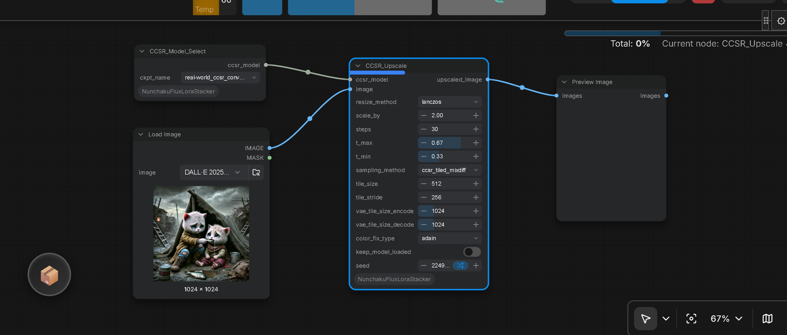

# ComfyUI-NunchakuFluxLoraStack-and-VariousTools

<table align="center">
  <tr>
    <td align="center" bgcolor="#e5e7eb" width="88" height="36"><a href="../README.md"><font color="#4b5563"><b>EN</b></font></a></td>
    <td align="center" bgcolor="#d4465e" width="88" height="36"><font color="#ffffff"><b>中文</b></font></td>
  </tr>
</table>

本仓库提供 **十三个** ComfyUI 自定义节点：

在 **AMD / ROCm**（以及其他无法导入官方 `nunchaku` 包的环境）下，**面向 Nunchaku FLUX 的功能会被禁用**，本包仍可加载，**其余节点可继续使用**。对 nunchaku 导入做保护、避免因缺少或导入失败而导致整包无法加载——这一思路来自 PR 提案者 **[0xDELUXA](https://github.com/0xDELUXA)**（[PR #6](https://github.com/ussoewwin/ComfyUI-NunchakuFluxLoraStacker/pull/6)）。

1. **FLUX LoRA Loader V2** (`FluxLoraMultiLoader_10`) - 用于 Nunchaku FLUX 模型的动态多 LoRA 加载，带下拉框 UI
    
    

2. **LoRA Stacker V2** (`LoraStackerV2_10`) - 用于标准 SD 模型（SDXL、Flux、WAN2.2 等）的通用 LoRA 加载器，带动态 10 槽位 UI
    
    

3. **LoRA Stacker V3** (`LoraStackerV3_10`) - 与 V2 相同的标准 SD 模型 LoRA 堆叠器，另增 **全局 `toggle_all`** 与 **每槽位 `enabled` 开关**，便于快速 A/B 对比与部分堆叠
    
    

4. **SDNQ LoRA Stacker V2** (`SDNQLoraStackerV2_10`) - 用于 SDNQ 量化模型的专用 LoRA 加载器，带动态 10 槽位 UI（设计用于 [comfyui-sdnq-splited](https://github.com/ussoewwin/comfyui-sdnq-splited)）
    
    

5. **Model Patch Loader** (`ModelPatchLoaderCustom`) - 加载模型补丁（ControlNet、特征投影器等），支持 CPU 卸载，并支持 ConvRot INT8
    
    

6. **Fast Groups Bypasser V2** (`FastGroupsBypasserV2`) - 基于组的节点控制工具（从 [rgthree-comfy](https://github.com/rgthree/rgthree-comfy) 移植）
    
    

7. **Universal LoRA Analyzer** (`UniversalLoRAAnalyzer`) - 分析 LoRA 文件（模型类型、触发词、基础模型、Civitai/HuggingFace URL）而无需将其加载到图中
    
    

8. **Color Filter** (`ColorFilter`) - 从视觉语言标记（如 Florence-2、WD14 Tagger）生成的描述文本中移除单色/黑白相关词语（支持内置模式和用户自定义排除词），然后再输入下游节点
    
    

9. **Florence-2**（四个节点：`DownloadAndLoadFlorence2Model`、`DownloadAndLoadFlorence2Lora`、`Florence2ModelLoader`、`Florence2Run`）— 加载 Florence-2 系列视觉语言检查点（Hugging Face 下载或本地 `models/LLM`），可选 PEFT LoRA，然后运行描述、OCR、DocVQA、定位、分割和提示生成任务；输出包括 `FL2MODEL`、`PEFTLORA`、标注图像、蒙版和字符串。

    

10. **ControlAltAI**（11 个节点）— 我的 Python 3.13 分支，现位于 `nodes/controlaltai/`（参见下方 **[ControlAltAI 节点](#controlaltai-节点)**）。

11. **CCSR**（三个节点：`DownloadAndLoadCCSRModel`、`CCSR_Model_Select`、`CCSR_Upscale`）— 加载 CCSR 模型（Hugging Face 自动下载或本地检查点），支持分块采样与颜色校正，执行高质量图像超分辨率放大（参见下方 **[CCSR 节点](#ccsr-节点)**）。
    
    

12. **Nunchaku Resolution Selector**（`NunchakuResolutionSelector`）— 从 Flux1 风格的宽高比预设（或自定义尺寸）选择宽高，输出 hires 尺寸、空 **16 通道** latent，以及 info 字符串（参见下方 **[Nunchaku Resolution Selector](#nunchaku-resolution-selector-nunchakuresolutionselector)**）。

    

---

## 功能 (V1 - 旧版节点)

- **动态槽位可见性**: LoRA 控件数量跟随 `lora_count`
- **简单 / 高级模式**: 在单强度和双强度输入之间切换
- **自动布局调整**: 节点高度根据可见控件自动扩展或收缩
- **Nunchaku FLUX 就绪**: 专为 Nunchaku FLUX 检查点格式构建

## 安装

1. 在您的 `ComfyUI/custom_nodes` 目录中克隆仓库：
   ```bash
   cd ComfyUI/custom_nodes
   git clone https://github.com/ussoewwin/ComfyUI-NunchakuFluxLoraStacker.git
   ```
2. 重启 ComfyUI 以加载节点。

## 使用方法

### 基本流程

1. 将 **Nunchaku FLUX LoRA Stack** 节点添加到您的工作流中。
2. 将 Nunchaku FLUX 基础模型连接到 `model` 输入。
3. 将 `lora_count` 设置为您想要激活的 LoRA 槽位数量。
4. 选择 `input_mode`：
   - **simple**: 使用 `lora_wt_X` 进行统一强度控制。
   - **advanced**: 使用 `model_str_X` 和 `clip_str_X` 进行分别的强度控制。
5. 在每个激活的槽位中选择 LoRA 文件并配置强度。
6. 将输出连接到图中的下一个节点。

### 参数

- **model**: Nunchaku FLUX 基础模型。
- **input_mode**
  - `simple`: 显示 LoRA 名称和单个强度滑块。
  - `advanced`: 显示独立的模型强度和 CLIP 强度滑块。
- **lora_count**: 要使用的 LoRA 槽位数量 (1-10)。
- **lora_name_X**: 槽位 X 的 LoRA 文件。
- **lora_wt_X**: 简单模式下的整体 LoRA 强度。
- **model_str_X** / **clip_str_X**: 高级模式下的独立强度。

## 动态 UI 行为

- 根据 `lora_count` 切换 LoRA 槽位。
- 根据 `input_mode` 切换强度控件。
- 调整节点高度以匹配可见的控件堆栈。
- 参数更改时立即刷新布局。

## 要求

- ComfyUI（推荐 2024 版本或更新版本）
- Nunchaku 核心包 (`nunchaku`) 需单独安装到环境中
- 与 Nunchaku FLUX 兼容的 LoRA 文件

---

## V2 节点 (v1.12 新增)

### 为什么选择 V2？

V2 节点是为支持 **ComfyUI Nodes 2.0 (桌面版)** 而开发的。新架构需要对控件管理和输入处理进行重大更改，这些更改与 V1 不兼容。

### 为什么保留 V1？

V1 节点 (`NunchakuFluxLoraStack`) 仍然可用，原因如下：
- **向后兼容**: ComfyUI 1.x 的用户可以继续使用现有工作流
- **功能保留**: V1 的 `input_mode` (simple/advanced) 对某些工作流仍然有用
- **渐进迁移**: 用户可以按自己的节奏过渡到 V2，而不会破坏现有项目

### V2 节点概览

本仓库现包含多个功能增强的 V2 节点：

### 1. FLUX LoRA Loader V2 (`FluxLoraMultiLoader_10`)

#### 功能
- **单一动态节点**: 一个节点，槽位数量可调 (1-10)
- **下拉框选择器**: 通过下拉菜单动态选择可见的 LoRA 数量 (1-10)
- **自动高度调整**: 节点自动调整大小以适应可见槽位
- **无验证错误**: 所有 LoRA 输入均为可选；隐藏的槽位不会导致错误
- **工作流持久化**: 设置会正确保存和恢复

#### 使用方法
1. 将 **FLUX LoRA Loader V2** 节点添加到您的工作流
2. 使用 **"🔢 LoRA Count"** 下拉菜单选择要显示的槽位数量
3. 仅配置可见槽位的 LoRA 文件和强度
4. 隐藏的槽位从 UI 中物理移除（无填充浪费）

#### 参数
- `model`: Nunchaku FLUX 基础模型 (必需)
- `🔢 LoRA Count`: 选择槽位数量的下拉菜单 (1-10)
- `lora_name_X`: LoRA 文件名 (可选)
- `lora_wt_X`: LoRA 强度，默认 1.0 (可选)

### 2. LoRA Stacker V3 (`LoraStackerV3_10`)

适用于 **标准 ComfyUI `MODEL` + `CLIP` 流水线**（SDXL、Flux、WAN2.2 等）的通用 LoRA 堆叠器。与 **LoRA Stacker V2** 相同的动态 1–10 槽位 UI，并增加 **开关控件**，便于快速对比与部分堆叠。

#### 功能
- **动态槽位数量**：**🔢 LoRA Count** 下拉框显示 1–10 个槽位；节点高度自动调整
- **全局总开关**：`toggle_all` — **关闭** 时 **不应用任何 LoRA**（输出原样透传）
- **每槽位开关**：`enabled_1` … `enabled_10` — 当 `toggle_all` **开启** 时，各槽位可独立启用或禁用
- **标准 LoRA 加载**：使用 ComfyUI `load_lora_for_models`（模型与 CLIP 强度绑定为同一数值）
- **负强度**：`lora_strength_X` 范围 **-100.0 至 100.0**（步长 0.01）

#### 开关行为
| `toggle_all` | `enabled_X` | 槽位 X 是否应用？ |
|--------------|-------------|-------------------|
| 关 | （任意） | 否 |
| 开 | 关 | 否 |
| 开 | 开 | 是（已选择 LoRA 文件且强度 ≠ 0） |

#### 使用方法
1. 从检查点加载器连接 **model** 与 **clip**
2. 将 **🔢 LoRA Count** 设为要显示的槽位数量
3. 使用 **toggle_all** 绕过整个 LoRA 堆叠，或按槽位切换 **enabled** 开关
4. 为启用的槽位选择 LoRA 文件并设置 **lora_strength**
5. 将 **MODEL** / **CLIP** 输出连接到图的其余部分

#### 参数
- `model`、`clip`：来自基础加载器的输入（必需）
- `toggle_all`：所有 LoRA 槽位的总开关（默认：True）
- `lora_count`：后端槽位上限（由 UI 同步；节点面上隐藏）
- `enabled_X`：每槽位启用（可选，默认 True）
- `lora_name_X`：LoRA 文件名或 `None`（可选）
- `lora_strength_X`：槽位 X 的强度（可选，默认 1.0）

### 3. Model Patch Loader (`ModelPatchLoaderCustom`)

#### 功能
- **CPU 卸载支持**: 可选择将模型补丁加载到 CPU 内存以节省 VRAM
- **多种模型类型**: 支持 QwenImage ControlNet、SigLIP 特征投影器和 ZImage ControlNet
- **自动检测**: 根据 state dict 键自动检测并加载正确的模型类型
- **灵活部署**: 在 CPU (内存) 或 GPU (VRAM) 加载之间选择
- **ConvRot INT8 支持**: 自动检测带有 comfy 原生 `int8_tensorwise`（ConvRot）量化的 ZImage ControlNet 检查点（基于 `comfy_quant` 元数据），并使用 `mixed_precision_ops` 加载；权重始终以 INT8 形式保存在内存中，运算通过 comfy-kitchen 的 `int8_linear` 内核（含在线 ConvRot 激活旋转）执行。GPU 加载与 CPU 卸载均支持

#### 使用方法
1. 将模型补丁文件 (`.safetensors` 或 `.ckpt`) 放入 `model_patches` 文件夹
2. 将 **Model Patch Loader** 节点添加到您的工作流
3. 从下拉菜单中选择模型补丁文件
4. 启用 `cpu_offload` 以加载到 CPU 内存（节省 VRAM），或禁用以进行 GPU 加载
5. 将 `MODEL_PATCH` 输出连接到兼容的节点

#### 支持的模型类型
- **QwenImageBlockWiseControlNet**: 用于 Qwen 图像生成模型的 ControlNet
- **SigLIPMultiFeatProjModel**: 用于风格特征的多特征投影模型
- **ZImage_Control**: Z-Image 格式 ControlNet（BF16 与 ConvRot INT8 版本）

#### 参数
- `name`: 模型补丁文件名 (必需)
- `cpu_offload`: 将模型加载到 CPU 内存而非 GPU (默认: True)

### 4. Fast Groups Bypasser V2 (`FastGroupsBypasserV2`)

**注意:** 此节点是从原始 [rgthree-comfy](https://github.com/rgthree/rgthree-comfy) 实现移植的，与 LoRA 加载功能无关。它作为工作流管理的实用工具包含在此处。

#### 功能
- **组过滤**: 通过颜色代码或正则表达式标题模式匹配
- **切换控制**: 使用复选框启用/禁用整个节点组
- **排序选项**: 位置、字母数字或自定义字母顺序
- **绕过/静音模式**: 选择效果模式
- **限制模式**: 默认、最多一个或始终一个组激活

#### 使用方法
1. 添加 **Fast Groups Bypasser V2** 节点
2. 通过属性或右键菜单配置过滤器
3. 使用生成的复选框控件切换组

---

## Florence-2 节点

视觉语言节点，基于 Florence-2 模型堆栈构建，位于 `nodes/florence2/` 下。它们在 ComfyUI 分类 **Florence2** 下显示。

### 上游和集成

此处的 Florence-2 实现源自 **[kijai/ComfyUI-Florence2](https://github.com/kijai/ComfyUI-Florence2)**。为支持 **Sage Attention 3** 和 **Transformers 5.x** API 维护了一个单独的分支；该分支已**合并到本仓库**的 `nodes/florence2/` 下，**以减少我自己的独立仓库维护**。

### 兼容性

- **Transformers 5.7**: 此集成针对 **Transformers 5.x** (包括 **5.7**) 进行了测试和维护。当 `transformers >= 5.0` 时，使用自定义加载器路径 (`nodes/florence2/nodes.py` 中的 `load_model`)，匹配当前的 `PreTrainedModel` / `dtype` API 和 Florence-2 处理器行为。使用 `requirements.txt` 中的行 `transformers>=4.39.0,!=4.50.*` 作为最低版本；升级到 **5.7** 对这些节点是支持的。
- **Sage Attention 3**: 加载器节点除了 `sdpa`、`eager` 和 `flash_attention_2` 外，还提供 **`sage_attention_2`** 和 **`sage_attention_3`** 注意力模式。当安装了 **Transformers ≥ 5.0** 时，自定义 Florence-2 注意力模块可以替换 SDPA 层以使用 Sage 模式（参见 `nodes/florence2/modeling_florence2.py` 和 `nodes/florence2/docs/FIX_04_sage_attention_support.md`）。如果选择了 Sage 但 Transformers 版本低于 5.0，节点将回退到 **SDPA** 并记录警告。

### 模型位置

- **HF 下载路径**: `DownloadAndLoadFlorence2Model` 将权重保存到 **`ComfyUI/models/LLM/<短仓库名>/`**（例如 `Florence-2-base` 对应 `microsoft/Florence-2-base`）。
- **本地路径**: `Florence2ModelLoader` 列出 **`ComfyUI/models/LLM`** 下已存在的子文件夹。

### 节点参考

| 节点 | 角色 |
|------|------|
| **DownloadAndLoadFlorence2Model** | 选择预设的 Hugging Face 仓库、`fp16` / `bf16` / `fp32`，以及**注意力**后端；可选的 **`PEFTLORA`** 输入和可选的 `.bin` → `.safetensors` 转换。返回 **`florence2_model`** (`FL2MODEL`)。 |
| **DownloadAndLoadFlorence2Lora** | 下载固定的 PixelProse LoRA 仓库以链接到加载器。返回 **`lora`** (`PEFTLORA`)。 |
| **Florence2ModelLoader** | 与 HF 下载器相同的输出，但 **`model`** 是 `models/LLM` 下的本地目录名。 |
| **Florence2Run** | 接收 **`IMAGE`**、**`FL2MODEL`**、**`text_input`** 和 **`task`**（如 `caption`、`detailed_caption`、`ocr`、`docvqa`、`region_proposal`……）。可选的采样控制、蒙版选择字符串和种子。返回 **`image`**、**`mask`**、**`caption`**、**`data`** (`JSON`)。 |

### 要求 (Florence-2)

从仓库根目录安装 Python 依赖（包括 Florence-2 和共享堆栈）：

```bash
python -m pip install -r requirements.txt
```

Florence-2 特定包包括 **transformers**、**accelerate**、**peft**、**timm**、**matplotlib** 和 **Pillow**，以及此包中其他地方使用的 **nunchaku**。

## ControlAltAI 节点

来自 ControlAltAI 系列的实用节点（在 ComfyUI 中分类为 **ControlAltAI utils**）。它们位于本包的 `nodes/controlaltai/` 下。

### 上游和集成

这些节点源自 **[gseth/ControlAltAI-Nodes](https://github.com/gseth/ControlAltAI-Nodes)** (MIT)。**我的 Python 3.13 兼容分支**已**合并到本包**的 `nodes/controlaltai/` 下，**以减少我自己的独立仓库维护**（相同的节点集）。

### 节点参考

完整的节点列表、参数和截图：**[zhmd/controlalttai.md](controlalttai.md)**。

**Integer Settings Advanced** 的前端辅助：`js/integer_settings_advanced.js`（从包根目录 `js/` 文件夹提供）。

---

## Color Filter (`ColorFilter`)

### 用途

图像描述和标记节点（如 **Florence-2** 或 **WD14 Tagger**）在描述照片时经常输出 "black and white" 或 "monochrome" 等短语。这些标记可能会泄漏到文本到图像的提示中，使采样器偏向灰度输出。**Color Filter** 是一个小型文本工具，可从字符串中移除这些表达，使下游工作流获得更清洁的条件文本。

### 何时使用

- 在 **Florence-2**（或类似的 VL 描述）节点之后，字符串预览/提示组装之前。
- 在 **WD14 Tagger**（或其他标记器）之后，当标签包含您不希望出现在正面提示中的黑白相关词汇时。
- 任何多行 `STRING`，您希望自动移除单色相关词语。

### 输入和输出

| 端口 | 类型 | 描述 |
|------|------|------|
| `text` | `STRING` (多行) | 来自上游分析节点的原始描述或标签字符串。 |
| `exclude_words` | `STRING` (单行) | 可选的手动词语/短语，以移除（用逗号或换行分隔）。默认为空。 |
| `filtered_text` | `STRING` | 移除内置和用户定义词语后的相同文本；连续空格标准化为单个空格（换行变为空格）。 |

### 行为说明

- 匹配使用正则表达式（常见英文术语具有词边界感知；非拉丁单色相关文字作为子字符串匹配）。典型的英文移除包括例如 `black and white`、`monochrome` 和 `grayscale`；完整的模式集在 `nodes/color_filter/color_filter.py` 中定义。
- 在 `exclude_words` 中指定的自定义排除词会被动态解析（按逗号和换行分割）、转义以防止正则表达式错误，并进行不区分大小写的匹配。它们被优先处理，在内置硬编码词之前匹配。
- 该节点位于 ComfyUI 菜单的 **Text/Filter** 分类下。

---

## CCSR 节点

基于 CCSR (Creative Content Super-Resolution) 架构的图像超分辨率放大节点，位于 `nodes/CCSR/` 下。它们在 ComfyUI 菜单的 **CCSR** 分类下显示。

### 上游和集成

此处的 CCSR 实现源自 **[kijai/ComfyUI-CCSR](https://github.com/kijai/ComfyUI-CCSR)**。为支持最新的 ComfyUI 环境和 **Python 3.13** 维护了一个单独的分支；该分支已**合并到本仓库**的 `nodes/CCSR/` 下，**以减少我自己的独立仓库维护**。

### 节点参考

| 节点 | 角色 |
|------|------|
| **DownloadAndLoadCCSRModel** | 从 Hugging Face 下载预训练的 CCSR 模型（`real-world_ccsr-fp16.safetensors` / `real-world_ccsr-fp32.safetensors`），或者在本地已存在于 `models/CCSR/` 下时直接加载。返回 **`ccsr_model`** (`CCSRMODEL`)。 |
| **CCSR_Model_Select** | 从标准 ComfyUI `checkpoints` 目录选择并加载本地 CCSR 权重文件。返回 **`ccsr_model`** (`CCSRMODEL`)。 |
| **CCSR_Upscale** | 使用已加载的 CCSR 模型执行图像超分辨率放大。支持自定义步数、分块参数控制（`ccsr_tiled_mixdiff` / `ccsr_tiled_vae_gaussian_weights`）以及颜色校正选项（`adain` / `wavelet`）。返回 **`upscaled_image`** (`IMAGE`)。 |

---

## Nunchaku Resolution Selector (`NunchakuResolutionSelector`)

输出像素尺寸与空 **16 通道** latent 的分辨率辅助节点。实现：`nodes/resolution_selector.py`。菜单分类：**ussoewwin/resolution**。

### 用途

从面向 Flux1 的预设列表（与 `nodes/controlaltai/` 下 ControlAltAI Megapixel Calculator 相同的宽高比词汇）选择画布尺寸，或输入自定义宽高。节点输出整型尺寸、经 `hires_scale` 计算的 hires 尺寸、空 **16 通道** latent（`batch × 16 × H/8 × W/8`），以及用于调试的简短 `info` 字符串。

### 输入

| 控件 | 类型 | 说明 |
|------|------|------|
| `mode` | `Preset` / `Custom` | `Preset` 使用下拉预设；`Custom` 使用 `custom_width` / `custom_height`。 |
| `preset` | combo | Flux1 宽高比预设（**1.0 MP**，64 对齐），以及 **High** 变体（**1.5 MP**）（例如 `1:1`、`2:3`、`3:4`、`4:5`、`9:16`、`16:9`、超宽比等）。 |
| `custom_width` / `custom_height` | INT（步进 8） | `mode` 为 `Custom` 时使用；预设字符串无法解析时作为回退。 |
| `hires_scale` | FLOAT（默认 `1.3`） | `hires_width` / `hires_height` 的倍率（四舍五入并对齐到 8 的倍数）。 |
| `batch_size` | INT | 空 latent 的 batch 维。 |

### 输出

| 端口 | 类型 | 说明 |
|------|------|------|
| `width` / `height` | INT | 选定的像素尺寸。 |
| `hires_width` / `hires_height` | INT | 应用 `hires_scale` 后的尺寸（最小 16，8 的倍数）。 |
| `latent` | LATENT | **16** 通道的空 samples 张量。 |
| `info` | STRING | 可读摘要（`mode`、来源、尺寸、倍率、batch）。 |

### 行为说明

- 预设标签内嵌 `WxH`（例如 `4:5 (Artistic Frame) (896x1088)`）；尺寸从该子串解析。
- Latent 空间尺寸为 `height // 8` × `width // 8`。
- 空 latent 的设备/dtype 跟随 ComfyUI 的 `intermediate_device` / `intermediate_dtype`。

---

## 发布历史

详见 [更新日志](CHANGELOG.md) 获取完整的发布历史。

## 致谢

- 动态 UI 实现基于 [efficiency-nodes-comfyui](https://github.com/jags111/efficiency-nodes-comfyui)
- Fast Groups Bypasser V2 从 [rgthree-comfy](https://github.com/rgthree/rgthree-comfy) 移植
- Florence-2 节点源自 [kijai/ComfyUI-Florence2](https://github.com/kijai/ComfyUI-Florence2)；在此扩展了 Sage Attention 3 和 Transformers 5.x 支持，然后集成到 `nodes/florence2/` 下（参见上方 **上游和集成**）
- ControlAltAI — 参见 **[ControlAltAI 节点](#controlaltai-节点)**（上游 MIT）
- CCSR 节点源自 [kijai/ComfyUI-CCSR](https://github.com/kijai/ComfyUI-CCSR)；在此扩展了最新 ComfyUI 和 Python 3.13 支持，然后集成到 `nodes/CCSR/` 下（参见上方 **上游和集成**）

## 许可证

- 本仓库根据 **Apache-2.0** 许可证授权
- Fast Groups Bypasser V2 从 [rgthree-comfy](https://github.com/rgthree/rgthree-comfy) 移植，根据 **MIT 许可证** 授权
- `nodes/florence2/` 下的 Florence-2 代码源自 [kijai/ComfyUI-Florence2](https://github.com/kijai/ComfyUI-Florence2)，根据 **MIT 许可证** 授权；有关该子树的完整文本和版权声明，请参阅 `nodes/florence2/LICENSE`。
- `nodes/controlaltai/` 下的 ControlAltAI 代码 — **MIT 许可证**（参见 [ControlAltAI 节点](#controlaltai-节点)）
- `nodes/CCSR/` 下的 CCSR 代码源自 [kijai/ComfyUI-CCSR](https://github.com/kijai/ComfyUI-CCSR)（基于原始 [csslc/CCSR](https://github.com/csslc/CCSR) 的 Apache-2.0 实现）。
